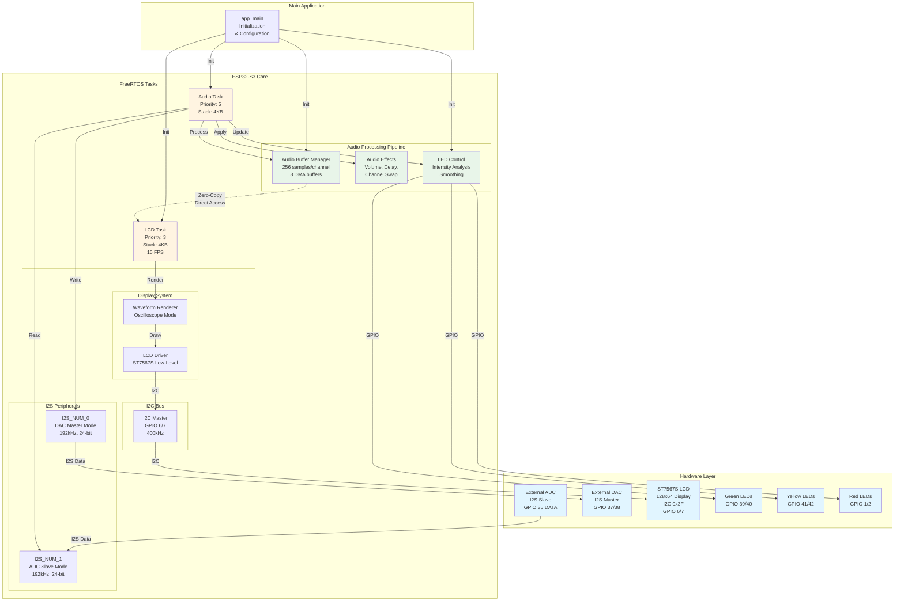
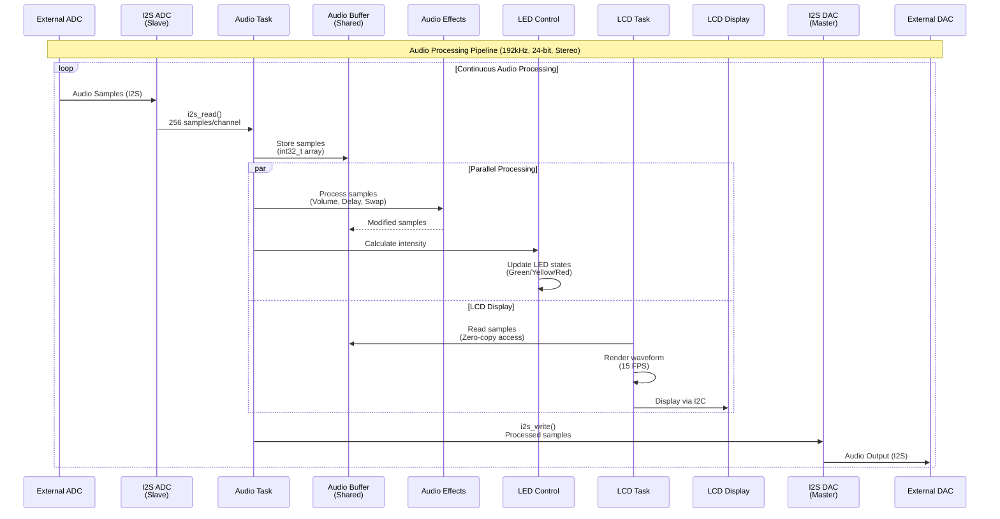
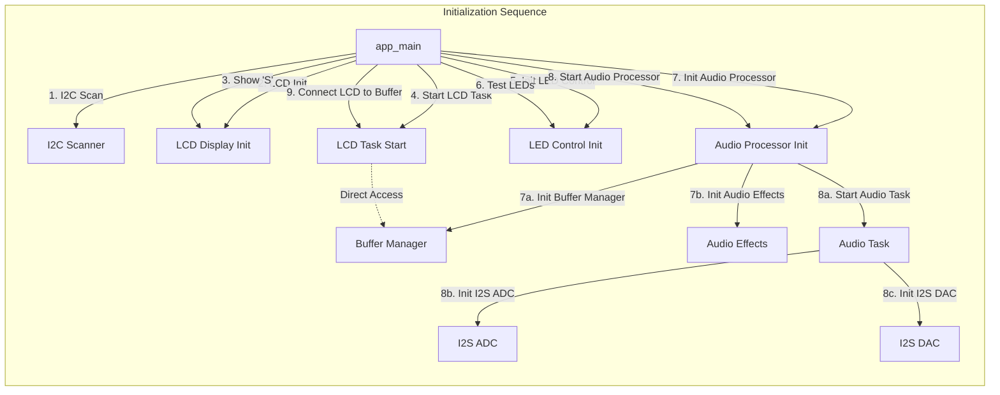
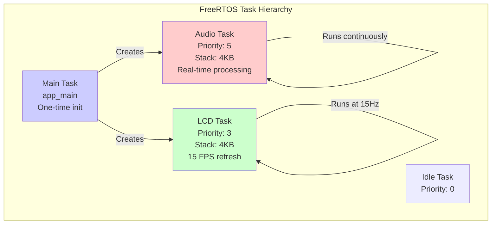
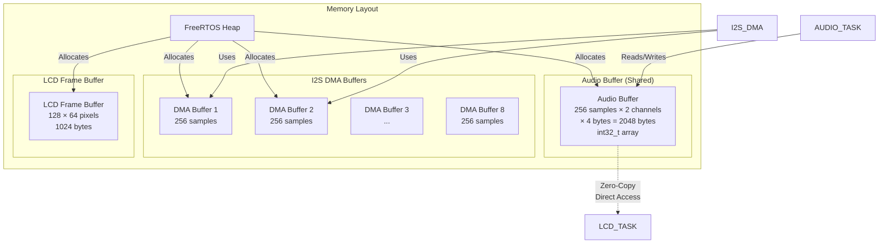
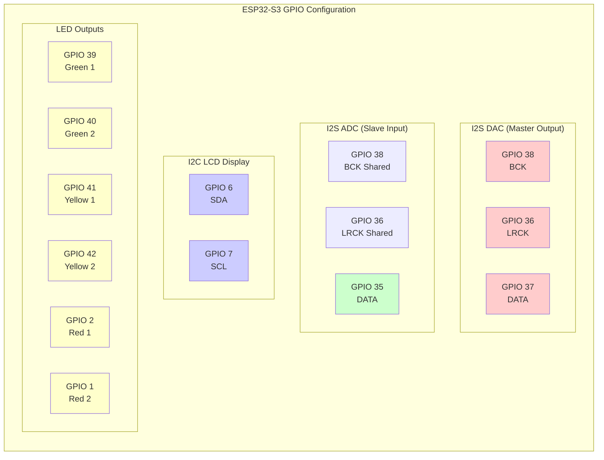
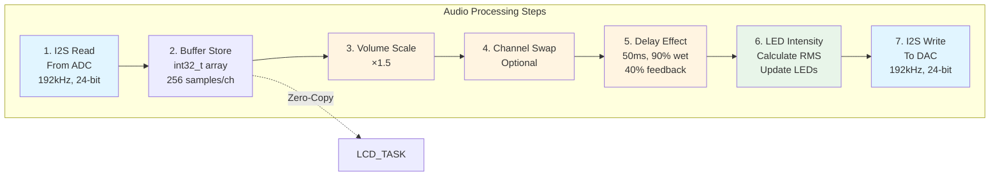
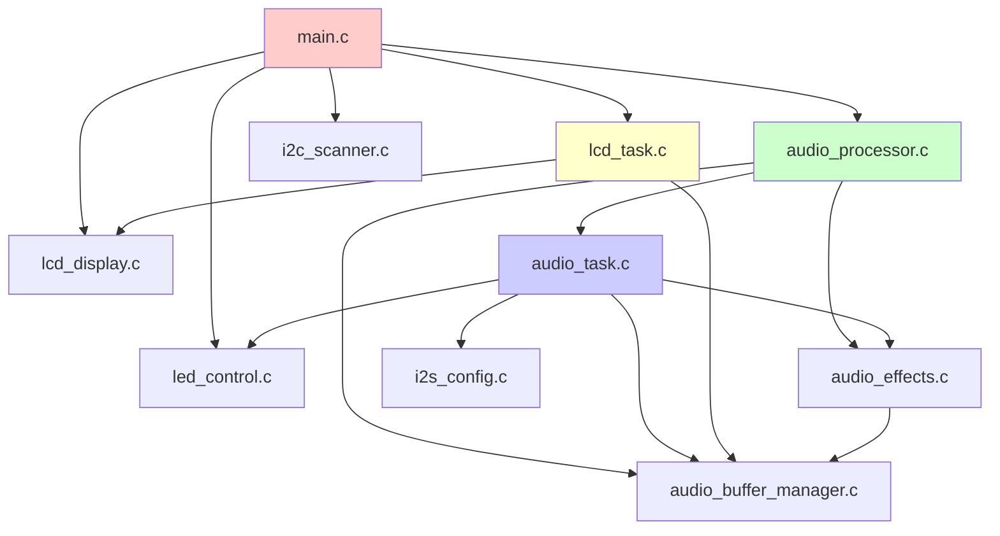
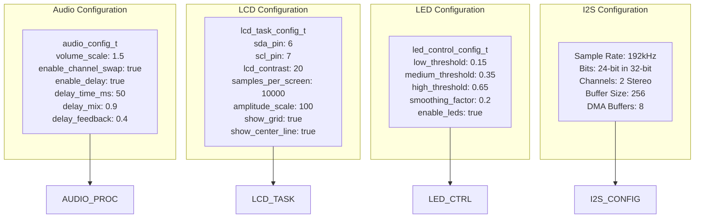

# ESP32-S3 Audio Processor DAC - Full Project Architecture Diagram

## System Architecture Overview

## Data Flow Diagram

## Component Interaction Diagram

## Task Structure and Priorities

## Memory and Buffer Architecture

## Hardware Pin Mapping

## Audio Processing Pipeline Detail

## Module Dependencies

## Configuration Parameters

## Key Features Summary

### Audio Processing
- **Sample Rate**: 192 kHz
- **Bit Depth**: 24-bit samples in 32-bit containers
- **Channels**: Stereo (2 channels)
- **Buffer Size**: 256 samples per channel
- **DMA Buffers**: 8 buffers for low latency

### Effects
- Volume scaling (1.5x default)
- Channel swapping
- Delay effect (50ms, 90% wet, 40% feedback)

### Display
- **Type**: ST7567S 128x64 LCD
- **Interface**: I2C (400 kHz)
- **Refresh Rate**: 15 FPS
- **Mode**: Oscilloscope waveform
- **Zero-Copy**: Direct buffer access

### LED Control
- **Green LEDs**: GPIO 39, 40 (low threshold: 15%)
- **Yellow LEDs**: GPIO 41, 42 (medium threshold: 35%)
- **Red LEDs**: GPIO 1, 2 (high threshold: 65%)
- **Smoothing**: 20% factor

### Task Priorities
- **Audio Task**: Priority 5 (real-time)
- **LCD Task**: Priority 3 (display)
- **Idle Task**: Priority 0 (background)

